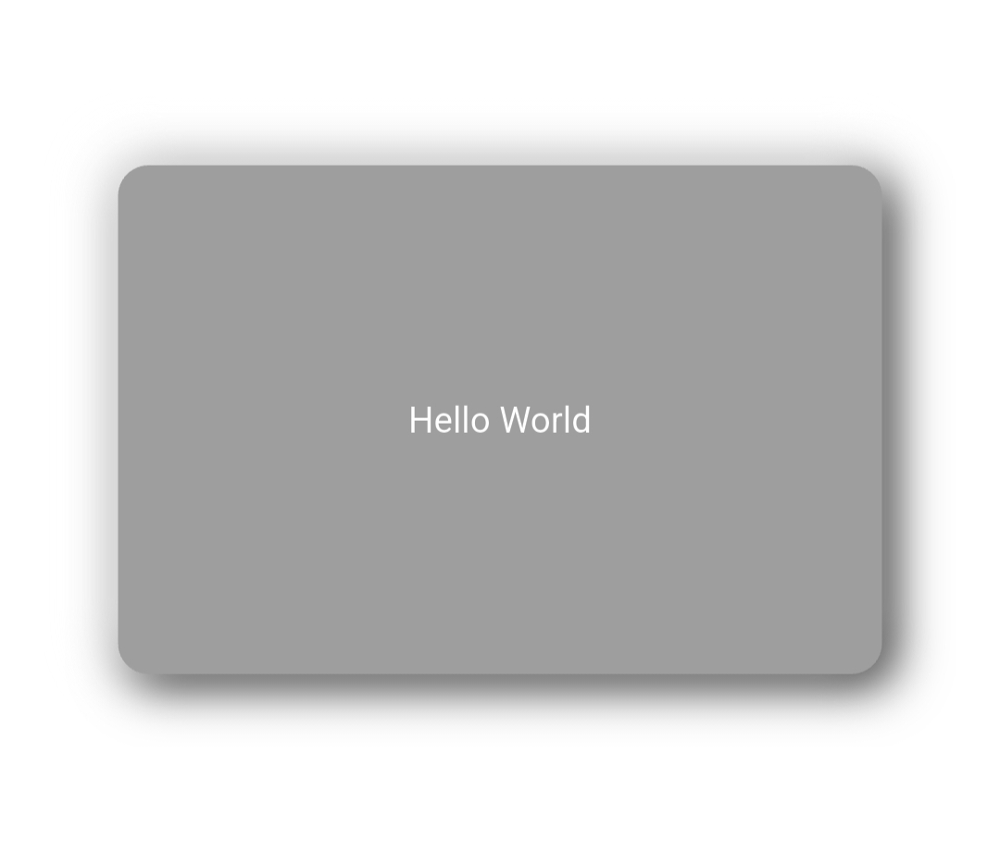

# NeuBox

neu_box is a customizable container widget that allows you to create beautiful neumorphic-style
containers in your Flutter apps with flexible shadow, radius, and content support.

## Installation

1. Add the latest version of package to your pubspec.yaml (and run`dart pub get`):

```yaml
dependencies:
  neu_box: ^0.0.2
```

2. Import the package and use it in your Flutter App.

```dart
import 'package:neu_box/neu_box.dart';
```

## Usage Example

You can customize the appearance of NeuBox by providing the following parameters:

| Property         | Type             | Description                             |
|------------------|------------------|-----------------------------------------|
| `height`         | `double`         | Height of the container                 |
| `width`          | `double`         | Width of the container                  |
| `containerColor` | `Color`          | Background color of the container       |
| `borderRadius`   | `double?`        | Optional corner radius                  |
| `image`          | `ImageProvider?` | Optional background image               |
| `offset1`        | `Offset`         | First shadow offset                     |
| `offsetColor1`   | `Color`          | Color of the first shadow               |
| `blurRadius1`    | `double`         | Blur radius of the first shadow         |
| `offset2`        | `Offset`         | Second shadow offset                    |
| `offsetColor2`   | `Color`          | Color of the second shadow              |
| `blurRadius2`    | `double`         | Blur radius of the second shadow        |
| `child`          | `Widget?`        | Optional child widget to display inside |

<hr>

<table>
<tr>
<td>

```dart
import 'package:flutter/material.dart';
import 'package:neu_box/neu_box.dart';

class ExampleScreen extends StatelessWidget {
  const ExampleScreen({super.key});

  @override
  Widget build(BuildContext context) {
    return Scaffold(
      backgroundColor: Colors.grey[300],
      body: Center(
        child: NeuBox(
          height: 150,
          width: 150,
          containerColor: Colors.grey[300]!,
          borderRadius: 16.0,
          offset1: const Offset(-6, -6),
          offsetColor1: Colors.white,
          blurRadius1: 10,
          offset2: const Offset(6, 6),
          offsetColor2: Colors.black26,
          blurRadius2: 10,
          child: const Icon(Icons.favorite, color: Colors.pink),
        ),
      ),
    );
  }
}
```

</td>
<td>
  
</td>
</tr>
</table>

## Next Goals

- [x] Support for dual box shadows

- [x] Custom blur and offset

- [x] Optional child widget and border radius

- [ ] Add tap interaction support

- [ ] Introduce animated variations

- [ ] Provide prebuilt neumorphic themes